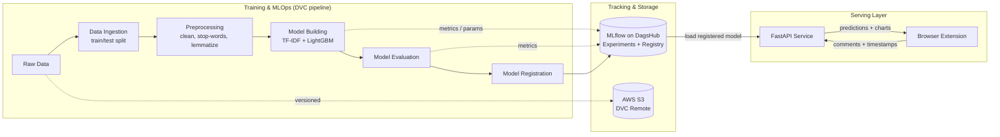

<div align="center">

# 🎥 YouTube Comment Sentiment Analysis

### An end-to-end, production-style MLOps project: NLP sentiment classification, a reproducible DVC pipeline, MLflow experiment tracking, a FastAPI inference service, and a browser-extension frontend.

[](https://www.python.org/)
[](https://fastapi.tiangolo.com/)
[](https://lightgbm.readthedocs.io/)
[](https://mlflow.org/)
[](https://dvc.org/)
[](https://aws.amazon.com/s3/)
[](https://www.nltk.org/)
[](LICENSE)

</div>

---

## 📑 Table of Contents

- [Overview](#-overview)
- [Key Highlights](#-key-highlights)
- [System Architecture](#-system-architecture)
- [Tech Stack](#-tech-stack)
- [ML Pipeline in Detail](#-ml-pipeline-in-detail)
- [Model Configuration](#-model-configuration)
- [Model Performance](#-model-performance)
- [Project Structure](#-project-structure)
- [Getting Started](#-getting-started)
- [Reproducing the Pipeline](#-reproducing-the-pipeline)
- [Running the API](#-running-the-api)
- [API Reference](#-api-reference)
- [Browser Extension](#-browser-extension)
- [Experiment Tracking & Model Registry](#-experiment-tracking--model-registry)
- [Design Decisions](#-design-decisions)
- [Roadmap](#-roadmap)
- [Contributing](#-contributing)
- [License](#-license)
- [Author](#-author)

---

## 🔍 Overview

Understanding audience reaction at scale is difficult: popular YouTube videos collect thousands of comments, and reading them manually is impractical. This project automates that analysis.

**YouTube Comment Sentiment Analysis** classifies comments as **Positive**, **Neutral**, or **Negative** and turns the results into actionable visual insight (sentiment distribution, word clouds, and sentiment-over-time trends). It is delivered as a **real-time API consumed by a browser extension**, so insights appear directly alongside the video being watched.

Beyond the model itself, the project is built the way production ML systems are built: **versioned data, parameterised and reproducible pipelines, tracked experiments, a model registry, and a decoupled serving layer.**

| Label | Meaning  |
| :---: | :------- |
| `1`   | Positive |
| `0`   | Neutral  |
| `-1`  | Negative |

---

## ✨ Key Highlights

- **End-to-end ML lifecycle**: data ingestion → preprocessing → training → evaluation → model registration, orchestrated as a five-stage **DVC pipeline**.
- **Fully reproducible**: all hyperparameters live in a single `params.yaml`; data and model artifacts are versioned with **DVC** and stored in an **AWS S3** remote.
- **Experiment tracking and model registry** with **MLflow**, hosted on **DagsHub**. The API loads the registered model directly from the registry at startup.
- **Production-oriented serving layer** built with **FastAPI**: typed request schemas (Pydantic), input validation, structured error handling, and CORS support.
- **Thoughtful NLP preprocessing**: negation and contrast words (`not`, `no`, `but`, `however`, `yet`) are deliberately *preserved* when removing stop-words so sentiment polarity is not lost.
- **Rich analytics endpoints**: sentiment pie chart, word cloud, and monthly sentiment trend graph, all generated server-side.
- **Thread-safe plotting**: Matplotlib's global state is protected with a lock, since the client requests multiple charts concurrently.
- **Full-stack delivery**: a browser-extension frontend consumes the API, demonstrating the model in a real user-facing workflow.

---

## 🏗 System Architecture



---

## 🧰 Tech Stack

| Category                 | Tools                                                  |
| ------------------------ | ------------------------------------------------------ |
| **Language**             | Python                                                 |
| **NLP**                  | NLTK (stop-words, WordNet lemmatizer), TF-IDF (n-grams) |
| **Machine Learning**     | LightGBM, scikit-learn-compatible vectorizer, Joblib   |
| **Data Processing**      | Pandas, NumPy                                          |
| **Visualisation**        | Matplotlib, Seaborn, WordCloud                         |
| **MLOps**                | DVC (pipelines + data versioning), MLflow, DagsHub     |
| **Cloud / Storage**      | AWS S3 (DVC remote), Boto3                             |
| **API / Serving**        | FastAPI, Uvicorn, Pydantic                             |
| **Frontend**             | Browser extension (`youtube_plugin_frontend`)          |

---

## ⚙️ ML Pipeline in Detail

The pipeline is defined in [`dvc.yaml`](dvc.yaml) and consists of five stages. DVC tracks dependencies, parameters, and outputs, so only the stages affected by a change are re-run.

| # | Stage                  | Script                                  | Key Outputs                                             |
| - | ---------------------- | --------------------------------------- | ------------------------------------------------------- |
| 1 | **Data Ingestion**     | `pipelines/data/data_ingestion.py`      | `data/raw/` (train/test split, configurable `test_size`) |
| 2 | **Data Preprocessing** | `pipelines/data/data_preprocessing.py`  | `data/interim/train_preprocessed.csv`, `test_preprocessed.csv` |
| 3 | **Model Building**     | `pipelines/model/model_building.py`     | `lgbm_model.pkl`, `tfidf_vectorizer.pkl`                |
| 4 | **Model Evaluation**   | `pipelines/model/model_evaluation.py`   | `experiment_info.json` (run metadata for registration)  |
| 5 | **Model Registration** | `pipelines/model/register_model.py`     | Model version in the MLflow Model Registry              |

### Text Preprocessing

Applied identically at training time and at inference time to prevent train/serve skew:

1. Lowercase and trim whitespace
2. Remove newline characters
3. Strip special characters (keeping `! ? . ,` which carry sentiment signal)
4. Remove English stop-words, **except** `not`, `no`, `but`, `however`, `yet`
5. Lemmatize tokens with WordNet

### Feature Engineering

**TF-IDF** vectorisation with **uni-, bi-, and tri-grams** (`ngram_range: [1, 3]`) to capture short phrases such as *"not good"* or *"really helpful"*, capped at 1,000 features.

---

## 🎛 Model Configuration

All values are centralised in [`params.yaml`](params.yaml) and consumed by the DVC pipeline, so changing a value and running `dvc repro` is all that is needed to run a new experiment.

```yaml
data_ingestion:
  test_size: 0.20

model_building:
  ngram_range: [1, 3]
  max_features: 1000
  learning_rate: 0.09
  max_depth: 20
  n_estimators: 367
```

---

## 📊 Model Performance

> Evaluation metrics are logged to MLflow for every run. Replace the placeholders below with the values from your registered model's run.

| Metric                 | Score |
| ---------------------- | :---: |
| Accuracy               | `XX.X%` |
| Precision (weighted)   | `XX.X%` |
| Recall (weighted)      | `XX.X%` |
| F1-score (weighted)    | `XX.X%` |

📎 Full experiment history: [MLflow on DagsHub](https://dagshub.com/MitadruMridha05/Youtube_Sentiment_Analysis.mlflow)

---

## 📁 Project Structure

```
Youtube_Sentiment_Analysis/
├── .dvc/                        # DVC configuration (remote storage settings)
├── data/                        # Versioned datasets (raw + interim), tracked by DVC
├── pipelines/
│   ├── data/
│   │   ├── data_ingestion.py        # Load data and create train/test split
│   │   └── data_preprocessing.py    # Text cleaning and normalisation
│   └── model/
│       ├── model_building.py        # TF-IDF + LightGBM training
│       ├── model_evaluation.py      # Metrics and MLflow logging
│       └── register_model.py        # MLflow Model Registry registration
├── youtube_plugin_frontend/     # Browser extension that consumes the API
├── app.py                       # FastAPI inference + visualisation service
├── dvc.yaml                     # Pipeline definition (5 stages)
├── dvc.lock                     # Locked pipeline state for reproducibility
├── params.yaml                  # Centralised hyperparameters
├── artifacts.dvc                # DVC-tracked model artifacts
├── requirements.txt             # Python dependencies
├── setup.py                     # Package setup
└── README.md
```

---

## 🚀 Getting Started

### Prerequisites

- Python 3.10+
- Git
- An AWS account with an S3 bucket *(only needed to pull or push DVC-tracked data)*
- A [DagsHub](https://dagshub.com/) account *(for MLflow tracking and the model registry)*

### Installation

```bash
# 1. Clone the repository
git clone https://github.com/MitadruMridha05/Youtube_Sentiment_Analysis.git
cd Youtube_Sentiment_Analysis

# 2. Create and activate a virtual environment
python -m venv venv
source venv/bin/activate        # Windows: venv\Scripts\activate

# 3. Install dependencies
pip install -r requirements.txt

# 4. Download required NLTK resources
python -c "import nltk; nltk.download('stopwords'); nltk.download('wordnet')"
```

### Environment Configuration

Provide credentials through environment variables. **Never commit secrets to the repository.**

```bash
# MLflow / DagsHub (needed to load the model from the registry)
export MLFLOW_TRACKING_USERNAME=<your-dagshub-username>
export MLFLOW_TRACKING_PASSWORD=<your-dagshub-token>

# AWS (needed for the DVC S3 remote)
export AWS_ACCESS_KEY_ID=<your-access-key>
export AWS_SECRET_ACCESS_KEY=<your-secret-key>
export AWS_DEFAULT_REGION=<your-region>
```

---

## 🔁 Reproducing the Pipeline

```bash
# Pull versioned data and artifacts from the DVC remote
dvc pull

# Run the full pipeline (only stale stages are re-executed)
dvc repro

# Visualise the pipeline DAG
dvc dag
```

To run a new experiment, edit values in `params.yaml` and run `dvc repro` again. DVC detects the change and re-runs only the affected stages.

---

## ▶️ Running the API

```bash
uvicorn app:app --host 0.0.0.0 --port 5000 --reload
```

On startup the service loads the registered model (`my_model`, version `1`) from the MLflow registry and the persisted `tfidf_vectorizer.pkl`. FastAPI's interactive documentation is then available at:

- **Swagger UI:** <http://localhost:5000/docs>
- **ReDoc:** <http://localhost:5000/redoc>

---

## 📡 API Reference

### `GET /`
Health check. Returns a welcome message.

### `POST /predict`
Classify a batch of comments.

**Request**
```json
{
  "comments": [
    "This tutorial was incredibly helpful, thank you!",
    "The audio quality is not good at all.",
    "I watched this today."
  ]
}
```

**Response**
```json
[
  { "comment": "This tutorial was incredibly helpful, thank you!", "sentiment": 1 },
  { "comment": "The audio quality is not good at all.", "sentiment": -1 },
  { "comment": "I watched this today.", "sentiment": 0 }
]
```

### `POST /predict_with_timestamps`
Same as `/predict`, but preserves each comment's timestamp so results can feed the trend graph.

**Request**
```json
{
  "comments": [
    { "text": "Loved this video!", "timestamp": "2025-03-14T10:30:00Z" }
  ]
}
```

### `POST /generate_chart`
Returns a **PNG** pie chart of sentiment distribution.

```json
{ "sentiment_counts": { "1": 120, "0": 45, "-1": 30 } }
```

### `POST /generate_wordcloud`
Returns a **PNG** word cloud generated from preprocessed comments.

```json
{ "comments": ["great content", "very informative", "not clear"] }
```

### `POST /generate_trend_graph`
Returns a **PNG** line chart showing the monthly percentage of positive, neutral, and negative comments over time.

```json
{
  "sentiment_data": [
    { "sentiment": 1, "timestamp": "2025-01-15T10:00:00Z" },
    { "sentiment": -1, "timestamp": "2025-02-03T18:20:00Z" }
  ]
}
```

**Error handling:** all endpoints return a JSON `{"error": "..."}` body with `400` for missing or invalid input and `500` for processing failures.

---

## 🧩 Browser Extension

The [`youtube_plugin_frontend`](youtube_plugin_frontend) directory contains the client that brings the model to the user:

1. Collects the comments (and timestamps) of the video being watched.
2. Sends them to the FastAPI service.
3. Renders the sentiment summary, word cloud, and trend graph alongside the video.

**To load it locally (Chrome / Chromium):**

1. Start the API (see [Running the API](#-running-the-api)).
2. Open `chrome://extensions` and enable **Developer mode**.
3. Click **Load unpacked** and select the `youtube_plugin_frontend` folder.
4. Open any YouTube video and launch the extension.

> Make sure the API base URL configured in the extension points to your running backend.

---

## 📈 Experiment Tracking & Model Registry

- **Tracking server:** MLflow, hosted on DagsHub.
- **Logged per run:** hyperparameters, evaluation metrics, and model artifacts.
- **Registry:** the evaluation stage writes `experiment_info.json`; the registration stage reads it and promotes the run's model to the registry.
- **Serving:** `app.py` resolves the model via `models:/<name>/<version>`, so the serving layer is decoupled from training and a new model version can be promoted without changing API code.

---

## 🧠 Design Decisions

| Decision | Rationale |
| -------- | --------- |
| **LightGBM over a neural model** | Fast to train and serve, strong on sparse TF-IDF features, and cheap to run for real-time inference. |
| **N-grams up to trigrams** | Captures negation and short phrases that single words miss. |
| **Preserving `not`, `no`, `but`, `however`, `yet`** | Standard stop-word lists remove words that flip or qualify sentiment. |
| **DVC + `params.yaml`** | Experiments are parameter-driven, cached, and reproducible by anyone with repo access. |
| **Registry-based model loading** | Clear separation between training and serving, with a path to versioned rollouts and rollbacks. |
| **Plot lock in the API** | Matplotlib's `pyplot` is not thread-safe; serialising plotting avoids corrupted figures under concurrent requests. |
| **Named-column feature frame at inference** | The MLflow model signature expects named float columns, so features are passed as a DataFrame to satisfy schema enforcement. |

---

## 🗺 Roadmap

- [ ] Add a `Dockerfile` and `docker-compose.yml` for one-command local setup
- [ ] CI/CD with GitHub Actions (linting, tests, `dvc repro` checks)
- [ ] Deploy the API to AWS (EC2 / ECS) behind HTTPS
- [ ] Unit and integration tests (preprocessing, API endpoints)
- [ ] Restrict CORS to approved origins for production
- [ ] Benchmark against transformer models (e.g. DistilBERT / RoBERTa)
- [ ] Multilingual comment support
- [ ] Model monitoring and data-drift detection
- [ ] Handle class imbalance more explicitly (class weights / resampling)

---

## 🤝 Contributing

Contributions, issues, and feature requests are welcome.

1. Fork the repository
2. Create a feature branch: `git checkout -b feature/your-feature`
3. Commit your changes: `git commit -m "Add your feature"`
4. Push to the branch: `git push origin feature/your-feature`
5. Open a Pull Request

---

## 📄 License

Distributed under the **MIT License**. See [`LICENSE`](LICENSE) for details.

---

## 👤 Author

**Mitadru Mridha**

[](https://github.com/MitadruMridha05)
[](https://www.linkedin.com/in/your-linkedin-id)
[](mailto:your-email@example.com)

<div align="center">

⭐ If you found this project useful, please consider giving it a star!

</div>
